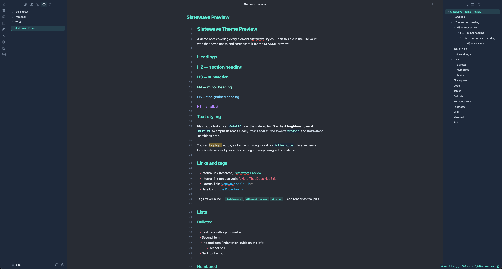

<div align="center">


<picture>
  <source media="(prefers-color-scheme: dark)" srcset="https://getslatewave.com/brand/wordmark-light.png">
  
</picture>

# Slatewave (Obsidian)

A dark [Obsidian](https://obsidian.md) theme on a slate foundation with a teal signature. Part of the [Slatewave family](#slatewave-family) — one palette across editors, terminals, prompts, notes, and more.

> _Slate below, teal above._



</div>

---

## What it styles

Slatewave is a from-scratch theme written against Obsidian's public CSS variable API — no upstream theme dependencies. It tunes:

- **Headings** — teal cascade (H1–H3 `#5eead4`, H4 `#99f6e4`, H5 `#7dd3fc`, H6 `#b388ff`), bold weight
- **Bullet markers** — pink `#fb7185` so lists read at a glance
- **Accent states** — active file, active tab, cursor, checkboxes, and outline selection all resolve to `#5eead4`
- **Links** — resolved teal, unresolved pink, external sky
- **Code** — inline pill with pale-teal foreground on `#1e293b`; fenced blocks get a soft border
- **Callouts** — tuned so `[!tip]`, `[!success]`, `[!warning]`, `[!error]`, `[!example]`, `[!quote]` each map to a distinct Slatewave accent
- **Tabs** — teal top indicator on the active tab, matching the VSCode theme
- **Status bar** — teal text on `#1e293b`, matching the oh-my-posh prompt's left block

Both dark and light modes are included. Dark is the primary target.

---

## Installation

### From the Community Theme browser

_(TBD — not yet published)_

### From a local clone

```sh
git clone https://github.com/kevinlangleyjr/obsidian-slatewave \
  ~/Obsidian/YourVault/.obsidian/themes/Slatewave
```

Open **Settings → Appearance → Themes** and pick **Slatewave**.

---

## Palette

Slatewave shares its palette with the companion VSCode theme and prompt. The anchor colors:

| | Hex | Tailwind | Role |
|---|---|---|---|
|  | `#282c34` | — | editor background |
|  | `#21252b` | — | sidebar, tabs |
|  | `#1e293b` | slate-800 | status bar, modals, code blocks |
|  | `#334155` | slate-700 | borders, dividers |
|  | `#e2e8f0` | slate-200 | body text |
|  | `#5eead4` | teal-300 | **primary accent** — headings, cursor, active state |
|  | `#99f6e4` | teal-200 | hover accent, H4 |
|  | `#7dd3fc` | sky-300 | H5, functions in code |
|  | `#38bdf8` | sky-400 | external links, keywords |
|  | `#b388ff` | — | H6, decorators |
|  | `#fb7185` | rose-400 | **list markers**, unresolved links, errors |
|  | `#fbbf24` | amber-400 | warnings, highlights |

See the [VSCode theme README](https://github.com/kevinlangleyjr/vscode-slatewave#palette) for the full scale and syntax mapping.

---

## Customize

Slatewave is a single `theme.css` built around CSS custom properties. To override a variable without forking, create a CSS snippet in `VAULT/.obsidian/snippets/slatewave-overrides.css`:

```css
.theme-dark {
  --interactive-accent: #34d399;  /* swap teal for emerald */
  --list-marker-color: #fbbf24;   /* amber bullets instead of pink */
}
```

Enable the snippet in **Settings → Appearance → CSS snippets**. Snippets load after the theme, so your overrides win.

---

## Slatewave family

One palette. Every tool.

- **Editors** — [VSCode](https://github.com/kevinlangleyjr/vscode-slatewave) · [Neovim](https://github.com/kevinlangleyjr/neovim-slatewave) · [Helix](https://github.com/kevinlangleyjr/helix-slatewave) · [Zed](https://github.com/kevinlangleyjr/zed-slatewave) · [Sublime Text](https://github.com/kevinlangleyjr/sublime-text-slatewave) · [JetBrains](https://github.com/kevinlangleyjr/jetbrains-slatewave)
- **Terminals** — [Alacritty](https://github.com/kevinlangleyjr/alacritty-slatewave) · [Ghostty](https://github.com/kevinlangleyjr/ghostty-slatewave) · [iTerm2](https://github.com/kevinlangleyjr/iterm2-slatewave) · [WezTerm](https://github.com/kevinlangleyjr/wezterm-slatewave) · [Windows Terminal](https://github.com/kevinlangleyjr/windows-terminal-slatewave)
- **Prompts** — [Oh My Posh](https://github.com/kevinlangleyjr/slatewave-omp) · [Starship](https://github.com/kevinlangleyjr/starship-slatewave)
- **Multiplexer** — [tmux](https://github.com/kevinlangleyjr/tmux-slatewave)
- **CLI** — [LSD](https://github.com/kevinlangleyjr/lsd-slatewave)
- **Notes** — [Logseq](https://github.com/kevinlangleyjr/logseq-slatewave) · [MarkEdit](https://github.com/kevinlangleyjr/markedit-slatewave)
- **Launchers** — [Alfred](https://github.com/kevinlangleyjr/alfred-slatewave) · [Raycast](https://github.com/kevinlangleyjr/raycast-slatewave)
- **Chat** — [Slack](https://github.com/kevinlangleyjr/slack-slatewave)

See [getslatewave.com](https://getslatewave.com) for the full family.
---

## Contributing

Issues and PRs welcome. For palette changes, include a before/after screenshot of the same note so the visual tradeoff is obvious.

---

## License

WTFPL — Do What The Fuck You Want To Public License. See [LICENSE](LICENSE).
